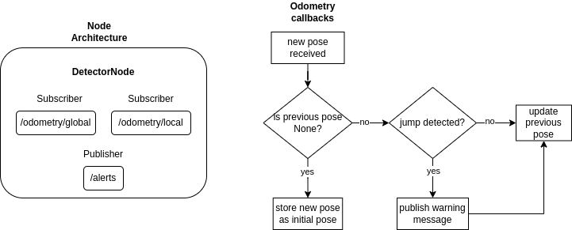

# Objective
Develop a ROS2 node that detects sudden jumps in position data from Extended Kalman Filters (EKFs) and simulate spoofing/jamming attacks on GPS inputs using the MOBSTA package.

# Background
You will be provided with a ROSBag containing all inputs and outputs of both local and global EKFs. Your challenge is to create a node that can identify abrupt changes in position data, potentially indicating security threats such as spoofing or jamming.

# Task Details
1. Node Development for Jump Detection:
    1. Write a ROS node that subscribes to the position outputs of local and global EKFs.
    2. Implement logic to detect and log significant jumps in position data, defining 'significant jump’ as more than e.g. 50 cm.
    3. Output a warning message to a specific topic for alerts when a jump is detected.
2. Using MOBSTA for Attack Simulation:
    1. Familiarize yourself with the MOBSTA package, designed for manipulating ROSBag data for testing.
    2. Use MOBSTA to modify the /gps/fix topic data in the ROSBag to introduce errors that simulate spoofing and jamming scenarios.
    3. Run your detection node with the mutated data to verify its ability to detect introduced anomalies.

# Implementation
## Part 1. Node
The node architecture and the implementation logic to detect jumps of more than 50 cm in either global or local positions in the odometry are described in the image below.



The node has one publisher and two subscribers. The callback functionality for both topics is mostly the same, with the only difference being the variable names used according to the topic.

When the callback receives a new position published in the respective odometry topic, if this is the first position received by the node, we only store it as the initial global/local pose to enable future comparisons. In the second scenario, if we receive a new odometry value and we already have a previous value stored as the position, we call the `jump_detection()` method.

The `jump_detection()` method is responsible for detecting sudden jumps between the previous and new position. It does this by calculating an offset value, which is obtained by taking the absolute value of the difference in the $x,y,z$ components of both arrays. Then, it compares the offset with a certain threshold (in this case, 50 cm). If the offset in any component is greater than or equal to this value, it indicates that a jump in the data has been detected.

If a jump in the data is detected, a warning message is published in the `/alerts` topic and a log message is displayed in the console. Finally, the position is updated with the new value received.

**Future Work**

Compare not only the $x,y,z$ values but also the covariance between the new and previous odometry poses. If the covariance indicates low confidence in the new position received, it may be better to wait for more updates before triggering the jump detection alarm.

## Part 2. MOBSTA
Unfortunately, I had many problems trying to install the package in my ROS2 setup, so I was not able to modify the /gps/fix topic data in the ROSBag using the MOBSTA package.

Instead, I tested the node by artificially modifying the odometry positions to force 50 cm jumps. The node behaved as expected, triggering warning messages when the offset was greater than the threshold.

# How to run?
## Clone the Package

First, you need to clone the package repository into the src directory of your ROS2 workspace.

* Open a Terminal: Open a terminal window.

* Navigate to Your ROS2 Workspace:
Navigate to the directory where your ROS2 workspace is located. This directory is commonly referred to as WS (Workspace).

```
cd ~/your_ros2_workspace
```
Replace ~/your_ros2_workspace with the path to your actual ROS2 workspace.

* Clone the repository of the package into the src directory of your workspace.

```
cd src
git clone https://github.com/dceres1/spoofing_jamming_detector.git
```
This will create a directory named spoofing_jamming_detector inside your src folder.

## Build the Package
After cloning the package, you need to build it using colcon.

* Navigate Back to the root of your workspace:

```
cd ..
```

* Build the Package: Use colcon to build the package. This command will compile all the packages inside your src directory.

```
colcon build
```

This process may take a few minutes depending on the size and number of packages in your workspace.

## Source Your Workspace
* Source the Setup Script
```
source install/setup.bash
```
This command should be run from the root of your workspace (the same directory where you ran colcon build).

## Run the Package
* Run the Node:
Use the ros2 run command to start the node. The general syntax is ros2 run <package_name> <node_name>.

```
ros2 run spoofing_jamming_detector detections_node
```

## Run rosbag
* Play the rosbag by using the command

```
ros2 bag play path_to_the_bag_file.db3
```